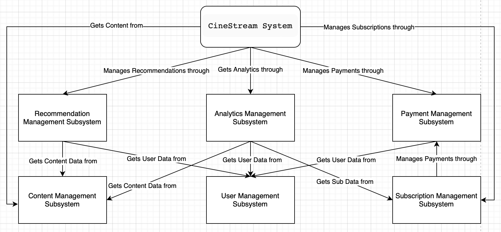
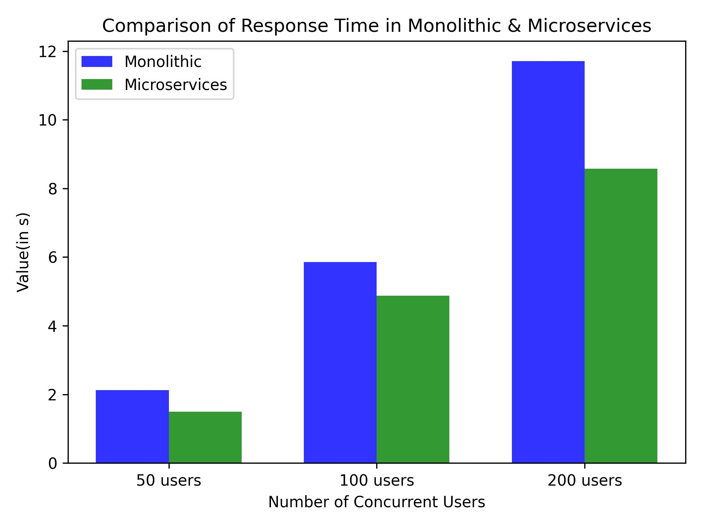
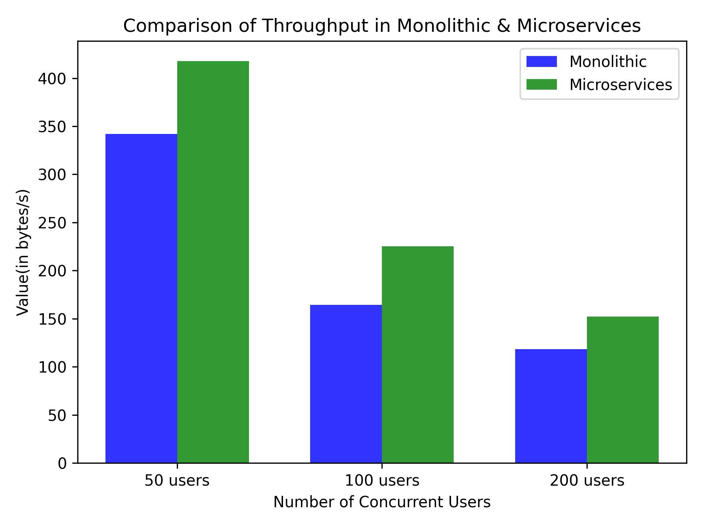
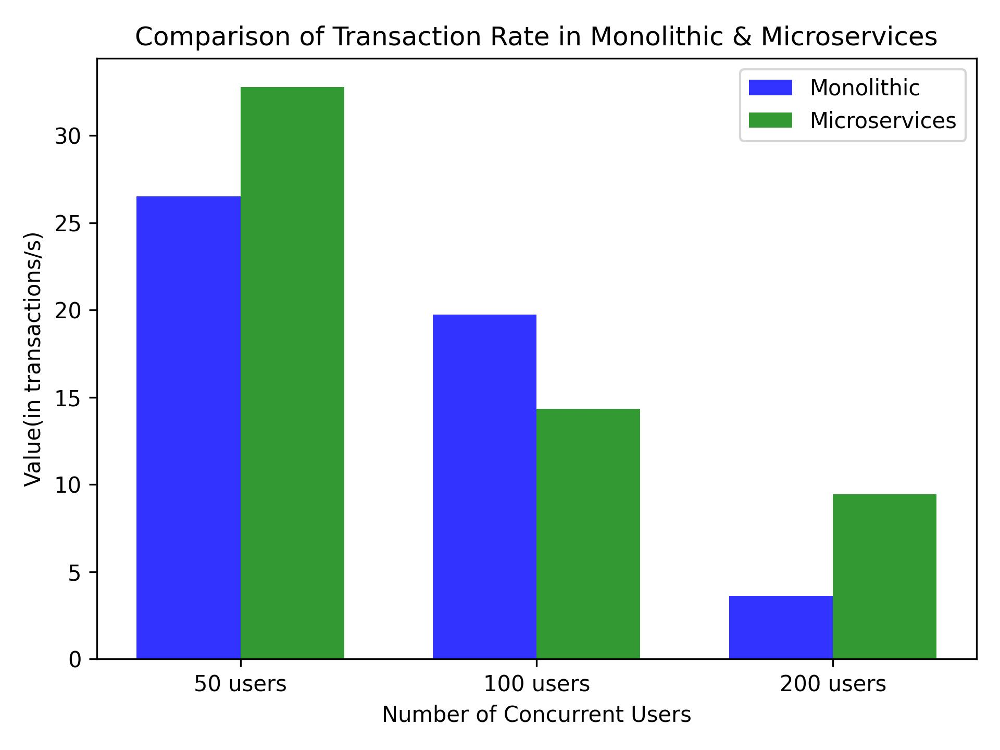
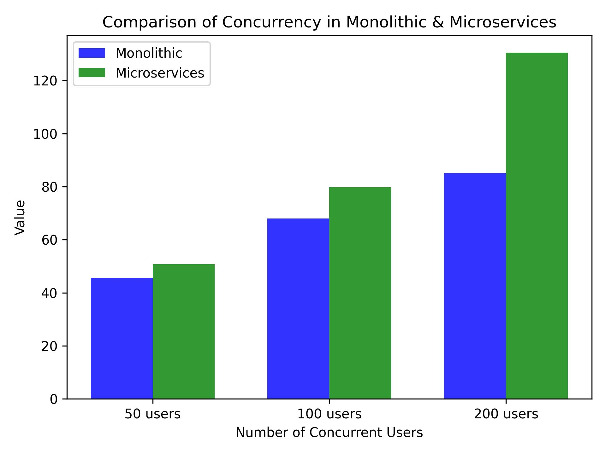

# Cinestream: A Video Streaming Platform

# Introduction

CineStream is an OTT platform that provides its users with a wide range of movies and other content from various OTT providers. The platform offers a flexible subscription model, personalized recommendations, and the ability to request movies. The platform is designed to be scalable and can handle different types of workloads and OTT providers.

# Table of Contents
1. [System Requirements](#system-requirements)
	- [Functional Requirements](#functional-requirements)
	- [Non-Functional Requirements](#non-functional-requirements)
	- [Architecturally Significant Requirements](#architecturally-significant-requirements)
	- [Main subsystems of CineStream](#main-subsystems-of-cinestream)
2. [Architecture](#architecture)
	- [C4 Diagrams](#c4-diagrams)
3. [Architectural Analysis](#architectural-analysis)
	- [Quality Attributes to be Analyzed](#quality-attributes-to-be-analyzed)
	- [Microservices Architecture v/s Monolithic Architecture ](#microservices-architecture-vs-monolithic-architecture)
	- [Results](#results)
4. [Implementation: From Architecture to Code](#implementation-from-architecture-to-code)

# System Requirements

## Functional Requirements:
- The platform should provide users with the ability to watch movies from CineStream as well as other OTT providers by paying a nominal rent on a pay-per-movie basis.
- The platform should allow users to watch the latest and classic movies in all languages.
- Users should be able to request movies on the platform.
- The platform should provide personalized recommendations to users.
- The platform should have a flexible subscription model with monthly or yearly charges.
- Allow users to request movies and make them available based on availability.
- Provide discounts on the subscription fee to active users based on their involvement.
- Collect user metrics, such as ratings, likes/dislikes and reviews for movies as well as time spent on movies, and the number of movies watched, to improve the overall experience.

## Non-Functional Requirements:
- The system should be able to handle different types of workloads and OTT providers.
- The system should ensure that one user can only stream content from one platform at a time.
- The system should provide a seamless experience to users despite the continuous inflow of data from different streaming platforms.
- The system should not store any sensitive data related to users due to privacy issues.
- The system should support a maximum of 2 devices per user.
- The system should provide easy means for admins/maintenance teams to access analytics related to platform use.
- The system should be environmentally friendly and minimize energy consumption and carbon footprint.

## Architecturally Significant Requirements:
1. **Integration with other OTT providers:** This is a key requirement as it is one of the main features that sets CineStream apart from other OTT platforms. It is important for the system to be able to integrate with APIs from other OTT providers to gather content and provide a seamless experience to users.
2. **Personalized recommendations:** This is another key requirement as it enhances the user experience by providing them with relevant content based on their preferences and behavior on the platform.
3. **Handling different types of workloads:** This is important as it ensures that the system can handle the varying demands of users who may be interested in different types of content from different OTT platforms.
4. **Scalability:** The platform needs to be scalable to accommodate different types of content and workloads. It should be able to handle the continuous inflow of data and provide a seamless user experience. Scalability is significant as the system needs to handle the increasing volume of data and users.
5. **Security and Privacy:** The system should maintain user privacy and security by not storing any sensitive data related to users. Security and privacy are essential to maintain user trust and confidence in the system. 
6. **Analytics:** The system should provide easy access to analytics for admins/maintenance teams to monitor platform usage and performance. Analytics provide insights into the system, enabling admins/maintenance teams to optimize the system.
7. **Sustainability:** The system should be environment friendly and consume minimal energy and have a low carbon footprint to be sustainable. Sustainability is crucial in today's world, and a system with a low carbon footprint is not only responsible but also cost-effective in the long run.

These requirements are architecturally significant because they have a major impact on the overall design and structure of the system.

## Main subsystems of CineStream:
1. **Content Management Subsystem:** This subsystem is responsible for managing the content available on the CineStream platform. It includes features such as adding new movies to the platform, integrating with APIs from other OTT providers to gather content, and handling user requests for movies.
2. **User Management Subsystem:** This subsystem is responsible for managing user accounts and profiles on the CineStream platform. It includes features such as user registration, login, and profile management. It also ensures that each user has a unique account, prevents unauthorized access to the platform, and tracks user activity for metrics collection and personalized recommendations.
3. **Recommendation Subsystem:** This subsystem is responsible for providing personalized recommendations to users based on their preferences and behavior on the platform. It uses various data mining and machine learning techniques to analyze user activity, preferences, and movie ratings to suggest movies to users that they are likely to enjoy.
4. **Subscription Management Subsystem:** This subsystem is responsible for managing the subscription model of the CineStream platform. It includes features such as processing subscription payments, providing discounts to active users, and handling subscription renewals.
5. **Analytics Subsystem:** This subsystem is responsible for collecting and analyzing data related to platform use. It provides insights to admins/maintenance teams on metrics such as the number of users, response time, server utilization, and throughput.
6. **Payment Subsystem:** This subsystem is responsible for processing payments for subscriptions and pay-per-movie rentals. It includes features such as processing payments, handling refunds, and providing discounts to active users.

Below is a diagram showing a high-level overview of the CineStream platform:

# Architecture

We intend to use the Microservices Architecture pattern for the implementation of CineStream.

The Microservices Architecture pattern involves designing the system as a collection of small, independent services that communicate with each other using well-defined interfaces. Each service is responsible for a specific piece of functionality and can be developed and deployed independently of the others.

This pattern could be a good fit for CineStream because it provides several benefits such as:

-   Scalability: The system can be easily scaled by deploying more instances of individual services to handle increased demand.

-   Flexibility: The system can be easily modified by updating or replacing individual services without affecting the rest of the system.

-   Resilience: The system can be made more resilient by designing services to handle failures gracefully and recover quickly.

By using the Microservices Architecture pattern, CineStream can achieve its non-functional requirements such as handling different types of workloads, providing fast response times, and ensuring the security and privacy of user data.

## C4 Diagrams:

### Context Diagram:

Description:

A Big Picture View of the overall system’s interactions with main stakeholders and external subsystems. The overall Cinestream system utilizes 4 external systems: A Recommendation system, an Analytics system, external OTT providers and a payment system. Their Specific functionality and relationships is described in the diagram

### Container Diagram:

Description:

A High Level Diagram of the Cinestream system. Since the selected architecture is based on microservices, the Relations between the Web Application (frontend) and separate microsystems is modeled here. The three major subsystems being modeled are:

- Content Management: The Primary database this microsystem interacts with is the content database, which contains the movies for the Cinestream application, which can only be accessed by users with a subscription. Since it is the central subsystem of Cinestream, it utilizes information with all 3 external systems (Recommendations, External OTT Provider and Payment)
- Subscription Management: The Primary database this microsystem interacts with is the subscription database, which contains all the subscription details of a user, including subscription start date, subscription type (yearly or monthly) and list of all movies the user has paid for from external OTT’s. It uses the payment system to manage the subscriptions
- User Management: The Primary database this microsystem interacts with is the user database, which has user details like user email, password, etc.

### User Management Microservice Component Diagram:

Description:

The major functionalities of this subsystem is to collect user analytics, allow sign in and allow modification of user details.

### Content Management Microservice Component Diagram:

Description:

The main subsystem of the Cinestream app. Its major functionalities are to enable streaming, allow user requests for new movies, acquiring movies from external OTT platforms and generating recommendations based on user activity and available content. 

### Subscription Management Microservice Component Diagram:

Description:

The main functionalities of this subsystem is to apply discounts on the subscription fee for active users, generate new subscriptions, renew subscriptions before they expire, maintain names of purchased movies of every user, and maintain a list of offers on movies for users.

# Architectural Analysis

We will be analysing & implementing 3 Microservices of our software architecture which are **User Management Microservice**, **Content Management Microservice** & **Subscription Management Microservice**. These will be implemented as independent services each with their own database & will be as decoupled as possible in accordance with the design pattern. These services are designed to be modular, scalable, and easy to deploy, and they communicate with each other through APIs.

## Quality Attributes to be Analysed

The quality attributes or Non-Functional Requirements (NFRs) that will be analysed are 
-	**Response time** which refers to the time it takes for a system to respond to a user's request or input, and is an important measure of system performance and usability. A system should have low response time in order to achieve good user experience & satisfaction.
-	**Throughput** which refers to the amount of work that a system can perform over a given period of time and is usually measured in bytes/second. A system with high throughput is typically considered to be of higher quality than a system with low throughput, all other things being equal.
-	**Transaction Rate** which refers to the number of transactions that a system can handle per unit of time, and it is an important measure of system performance, scalability, and reliability.
-	**Concurrency** which refers to on average how many  were executed simultaneously the web server. Sometimes, high concurrency is a trait of a poorly functioning website. The longer it takes to process a transaction, the more likely they are to queue. When the queue swells, concurrency rises.

## Microservices Architecture v/s Monolithic Architecture 

We will be using the Monolithic pattern for comparing it with our Microservices Architecture. Monolithic architecture is a traditional approach where the entire application is built as a single, self-contained unit. We used this pattern as we wanted to compare & contrast this approach with the newer Microservices pattern where the application is broken down into small, independent services. We wanted to illustrate the advantages of Microservices approach over Monolithic. Some of the significant ones are: 
- **Flexibility**: Microservices architecture allows for each service to be developed and deployed independently, using different technologies and programming languages. This enables developers to use the best tools for each service, without being limited by the constraints of a monolithic architecture.
- **Resilience**: In a monolithic architecture, a single bug or failure can bring down the entire application. In a microservices architecture, each service is isolated and can continue to function even if one or more services fail.
- **Faster development**: Because microservices are smaller and more focused, they are easier to develop, test, and deploy. This allows for faster development cycles and more frequent releases.  

## Results
	
We used the Siege tool to simulate users and make 100s of API requests to our system concurrently. It allows one to hit a server with a configurable number of concurrent simulated users. 
The following results were obtained by simulating concurrent users for 1 minute making request to all the services simulataneously such as registering new users, logging in users, getting videos from cinestream local as well as other OTT platforms, checking subscriptions of users and adding new subscriptions. 

50 users for 1 minute:

| Measure | Monolithic | Microservices |
| ---------- | ------------- | ---------------- |
| Response Time | 2.12s | 1.49s |
| Throughput | 341.83 bytes/s | 417.73 bytes/s |
| Transaction Rate | 26.51 trans/s | 32.79 trans/s |
| Concurrency | 45.54 | 50.72 | 

100 users for 1 minute:

| Measure | Monolithic | Microservices |
| ---------- | ------------- | ---------------- |
| Response Time | 5.86s | 4.87s |
| Throughput | 164.31 bytes/s | 225.23 bytes/s |
| Transaction Rate | 19.75 trans/s | 14.34 trans/s |
| Concurrency | 68.08 | 79.77 | 

200 users for 1 minute:
| Measure | Monolithic | Microservices |
| ---------- | ------------- | ---------------- |
| Response Time | 11.71s | 8.5s |
| Throughput | 118.20 bytes/s | 152.34 bytes/s |
| Transaction Rate | 3.62 trans/s | 9.45 trans/s |
| Concurrency | 85.09 | 130.51 | 

Graphs:

Comparison of Response Time:

Comparison of Throughput:

Comparison of Transaction Rate:

Comparison of Concurrency:

We observe that Microservices architecture performs consistently better than Monolithic for all the 4 quality attributes. This is because each service in a microservice architecture is independent, can be scaled, uses its own database, is more focused and communicates through well defined APIs. Also, the measures deteriorate as the number of simulated users increase because computational resources are limited and therefore an increase in number of users affects both architectures. However, Microservices performs better than monolith in every scenario.

From the above analysis, we can infer that Microservices architecture is preferable to Monolithic. It has small, independent services that are loosely coupled. It is easier to extend & maintain as a single small team of developers can write and maintain a service. However, it also requires careful planning and management, as the system can become complex and difficult to maintain if not properly designed and implemented.

# Implementation: From Architecture to Code

We have implemented the 3 microservices of our software architecture in the form of a prototype. The code for the same can be found in the repository. The implementated microservices are:
1. **Content Service**: This service is responsible for fetching content from the local database as well as from other OTT platforms. It also provides the functionality of adding new content to the database. 
2. **User Service**: This service is responsible for registering new users and logging in existing users.
3. **Subscription Service**: This service is responsible for checking the subscription status of users and adding new subscriptions.

The microservices have been implemented using **spring boot** and the database used is **Hibernate**. The microservices communicate with each other using **REST APIs**. We have also implemented a simple UI for the user to interact with the system. The **UI** is implemented using **ReactJS**. The UI allows the user to register, login, view content, check subscription status and add new subscriptions. Apart from this, a **service discovery** server has also been implemented using **Eureka**. The service discovery server is responsible for registering all the microservices and providing a list of all the registered microservices registered to the the **services registry**. The frontend communicates to the backend through an **API gateway** implemented using **Spring Cloud**. The API gateway is responsible for routing incoming requests from the frontend to the appropriate microservice based on the requested resource. It acts as an entry point for all the incoming requests and provides a single endpoint for the frontend to communicate with all the microservices. Additionally, the API gateway provides features like load balancing, caching, and security for all the microservices. The overall architecture of the system is designed to be scalable, fault-tolerant, and easily maintainable.

The demo video of the prototype can be found [here.](https://drive.google.com/drive/folders/1KWwuTkCVvW1ZVA7a8gWGKs_4JUCXoIW2?usp=sharing)
